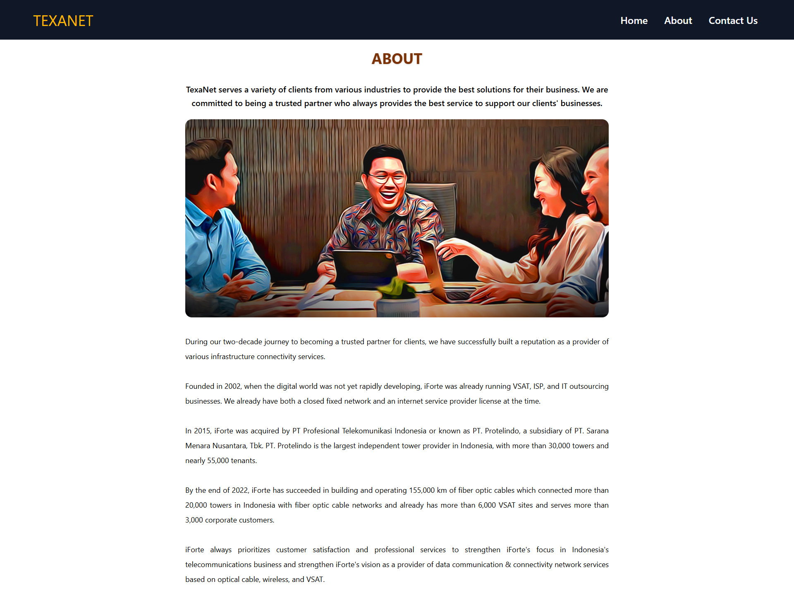
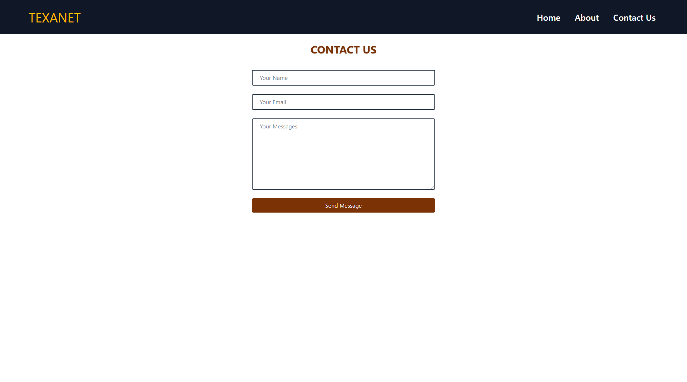

# React Example Project
This repository contains React project Minitask 4 with React Router example. This project deals with the application of routers in react by creating a simple website with 3 pages.

## Preview






## How to Run this project

1. Clone this project
```
git clone https://github.com/yusufbahtiarr/fgo24-react-pages.git
```
2. Enter the project directory
```
cd fgo24-react-pages
```
3. Install the Depedencies
```
npm install
```
4. Run the project
```
npm run dev
```
5. Project will running on http://localhost:8080

## Dependencies

This project using nodejs to run, so make sure to install node on your machine.
- live-server: to mock http server in local environtment

## How to Contribute

Please open PR to contributed to this project, i will review and merge if its needed.

## License

This project following MIT License

## Copyright
&copy; 2025 Kodacademy
